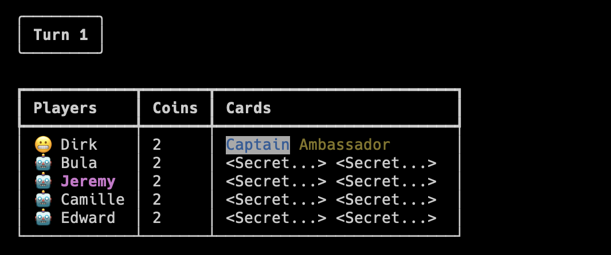

<br/>
<p align="center">
  <h3 align="center">The Resistance: Coup</h3>

  <p align="center">
    A text-based version of the popular party game, made using rich!
    <br/>
    <br/>
    <a href="https://github.com/dirkbrnd/resistance_coup/issues">Request Feature</a>
  </p>
</p>

    

## About The Project



This is a terminal text-based version of [The Resistance: Coup](https://www.ultraboardgames.com/coup/game-rules.php#google_vignette). I suggest you make yourself familiar with the rules before playing!

In a nutshell:

* You have some character cards representing government officials you have influence over.
* You can perform actions to sabotage other players and reduce their influence (i.e. remove their cards)
* The last person with any cards left is the winner!

The main package to mention here is [Rich](https://github.com/Textualize/rich). It was instrumental in making it as pretty as possible on the terminal!

## Getting Started

### Prerequisites

* This project is built on Python 3.11.
* The packages are maintained with [poetry](https://github.com/python-poetry/poetry).

### Steps to get playing

1. Clone the repo

```sh
git clone https://github.com/dirkbrnd/resistance_coup.git
```

2. Install the game

```sh
poetry install
```

3. Launch!

```sh
python coup.py
```

## Usage

* When the game starts it will ask your name.
* You will play against 4 other AI players.
* The game will continue until there is a winner (or if you lose you can force a restart...)
* You can play again after winning/losing.

## Roadmap

See the [open issues](https://github.com/dirkbrnd/resistance_coup/issues) for a list of proposed features (and known issues).

## Contributing

Contributions are what make the open source community such an amazing place to be learn, inspire, and create. Any contributions you make are **greatly appreciated**.
* If you have suggestions for adding or removing projects, feel free to [open an issue](https://github.com/dirkbrnd/resistance_coup/issues/new) to discuss it, or directly create a pull request after you edit the *README.md* file with necessary changes.
* Please make sure you check your spelling and grammar.
* Create individual PR for each suggestion.

### Creating A Pull Request

1. Fork the Project
2. Create your Feature Branch (`git checkout -b feature/AmazingFeature`)
3. Commit your Changes (`git commit -m 'Add some AmazingFeature'`)
4. Push to the Branch (`git push origin feature/AmazingFeature`)
5. Open a Pull Request

## License

Distributed under the MIT License. See [LICENSE](https://github.com/dirkbrnd/Resistance Coup/blob/main/LICENSE.md) for more information.

## Acknowledgements

* [Aaron Yuan](https://www.linkedin.com/in/aaron-yuan-776312a5/) for the inspiration!

